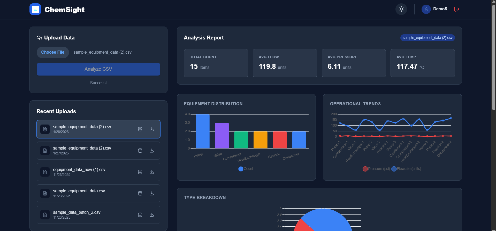
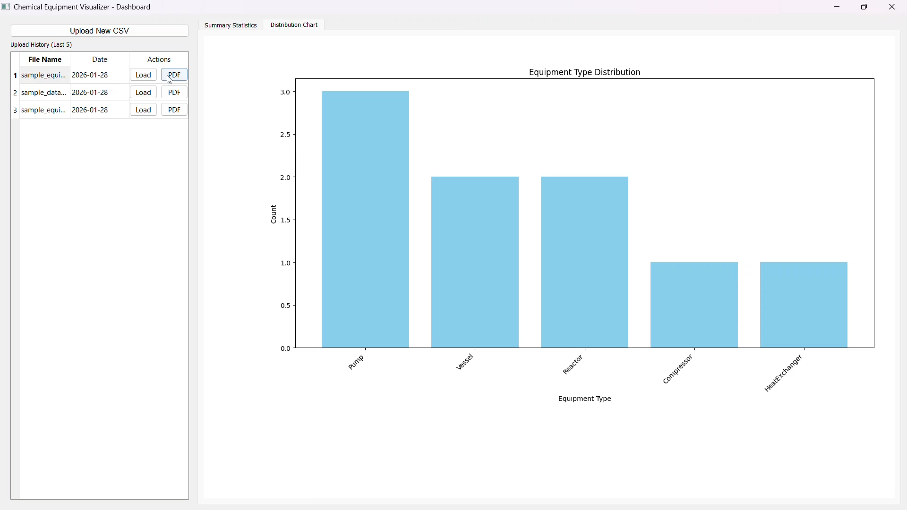

# ChemSight – Chemical Equipment Parameter Visualizer

**A Hybrid Application for Industrial Data Analytics (Web + Desktop)**

ChemSight is a full-stack hybrid application designed to visualize and analyze chemical equipment parameters (Flowrate, Pressure, Temperature). It features a synchronized **React Web Dashboard** and a **PyQt5 Desktop Application**, both powered by a unified **Django REST API**.

Users can upload CSV datasets to generate instant analytics, interactive charts, and downloadable reports (PDF/Excel).

---

## 🛠 Tech Stack

| Component | Technologies Used |
| :--- | :--- |
| **Backend** | Django 5, Django REST Framework, SQLite, Pandas, ReportLab |
| **Web App** | React.js, Chart.js, Tailwind CSS, Axios |
| **Desktop App** | Python, PyQt5, Matplotlib (embedded visualization) |
| **Deployment** | Netlify (Frontend), Render (Backend API) |

---

## 📸 Screenshots

| **Web Dashboard** | **Desktop Application** |
| :---: | :---: |
|  |  |
---

## 🚀 Live Demos

* **Web App (Netlify):** [https://chem-sight.netlify.app](https://chem-sight.netlify.app)
* **Backend API (Render):** [https://chemical-api-2026.onrender.com/admin/](https://chemical-api-2026.onrender.com/admin/)

> **Note:** The backend is hosted on a free instance. Please click the **Backend API** link first to "wake it up" (it may take 50 seconds to load initially).

### 🔐 Demo Credentials
To test the live system, you can use these guest credentials or create a new account:

* **Username:** `Admin`
* **Password:** `Admin123`

---

## 📂 Project Structure

```text
fossee-semester-intern-2026/
├── backend/                  # Django Project Root
│   ├── api/                  # REST API Endpoints & Logic
│   ├── visualizer_project/   # Project Settings
│   ├── manage.py
│   └── requirements.txt
├── frontend-web/             # React Web Application
│   ├── src/                  # Components (Charts, Dashboard, Tables)
│   ├── public/
│   └── package.json
├── frontend-desktop/         # PyQt5 Desktop Application
│   ├── main.py               # Entry Point
│   └── requirements.txt
├── sample_data_batch_2.csv   # Sample Dataset for Testing
└── README.md

```

---

##  Features

1. **Unified Backend:** A single Django API serves both Web and Desktop clients.
2. **Data Visualization:** Interactive Bar, Line, and Pie charts using Chart.js (Web) and Matplotlib (Desktop).
3. **Detailed Analytics:**
    * **Summary Cards:** Total count, Averages (Pressure, Temp, Flow).
    * **Distribution:** Breakdown of equipment types (Pumps, Valves, etc.).
    * **Data Preview:** Full-width, scrollable raw data table.
4. **History Tracking:** Sidebar retains the last 5 uploaded datasets for quick switching.
5. **Reporting:** One-click export to **PDF** (with charts) and **Excel** (with raw data).

---

##  Local Setup Guide

### Prerequisites

* Python 3.10+
* Node.js 16+
* Git

### 1. Backend Setup (Django)

Open your terminal in the project root:

```powershell
# Create virtual environment
python -m venv venv

# Activate (Windows)
.\venv\Scripts\Activate

# Install dependencies
pip install -r backend/requirements.txt

# Run Migrations & Create User
cd backend
python manage.py makemigrations
python manage.py migrate
python manage.py createsuperuser  # Create your local login

# Start Server
python manage.py runserver

```

*API will run at: `http://127.0.0.1:8000/*`

### 2. Web App Setup (React)

Open a new terminal:

```powershell
cd frontend-web

# Install dependencies
npm install

# Start Client
npm start

```

*App will open at: `http://localhost:3000/*`

### 3. Desktop App Setup (PyQt5)

Open a new terminal (ensure `venv` is active):

```powershell
# Navigate to desktop folder
cd frontend-desktop

# Install desktop-specific requirements
pip install -r requirements.txt

# Run App
python app.py

```

---

## 🔗 API Endpoints Overview

| Method | Endpoint | Description |
| --- | --- | --- |
| `GET` | `/api/ping/` | Health check (No Auth) |
| `POST` | `/api/upload/` | Upload CSV File (Multipart) |
| `GET` | `/api/summary/` | Get latest dataset stats & charts |
| `GET` | `/api/history/` | Get list of last 5 uploads |
| `GET` | `/api/export/pdf/` | Download Analytics Report (PDF) |
| `GET` | `/api/export/excel/` | Download Data Sheet (XLSX) |

---

## 📝 Submission Details

* **Repository:** [GitHub Link](https://github.com/PRAJEENS2024/fossee-semester-intern-2026)
* **Video Demo:** [Watch on Google Drive](https://drive.google.com/file/d/1OYbGRAzsZ9zYaDBErjtl26GNhSygG-eE/view?usp=drive_link)
